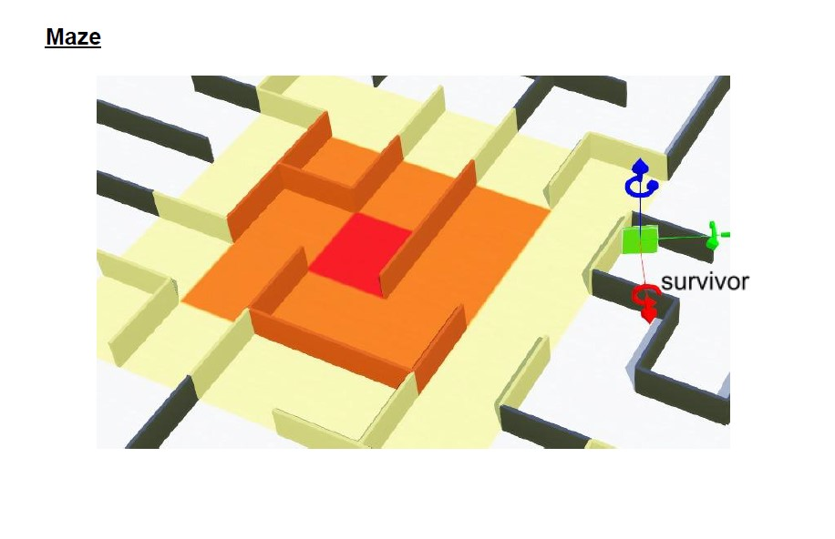
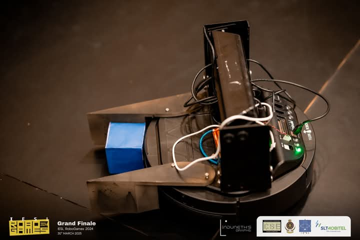
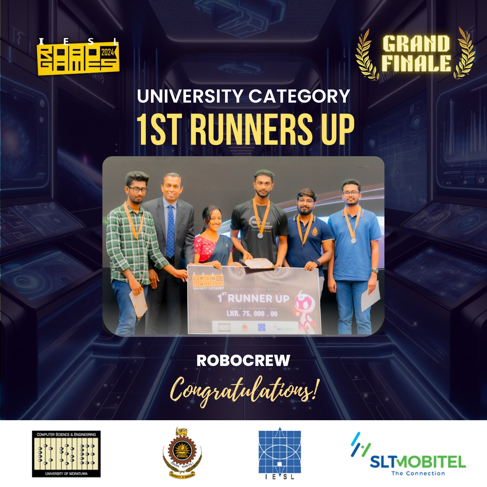

#  IESL Robogames 2024 – 1st Runner Up 🏆

A robotics and AI adventure through maze navigation, path planning, and real-time color detection – this repo showcases our team's work that secured **1st Runner Up** at the **IESL Robogames 2024**. From virtual simulations to real-world robots, we tackled every challenge head-on across three intense rounds.

---

## 🌀 Competition Rounds Breakdown

### 🔵 Initial Round – Webots + DFS

**Objective:**  
Navigate an e-puck robot through a color-sequence maze and return to the start point autonomously.

**Tech Stack:**  
- Webots Simulator  
- Python  
- Depth-First Search (DFS)

**Highlights:**  
- Custom color sensors for sequence validation  
- Stack-based DFS implementation with backtracking  
- Real-time visualization of the robot's path

---

### 🟢 Semi-Finals – Rescue Robot with Dijkstra’s Algorithm

**Objective:**  
Traverse a grid maze to rescue 3 survivors (green squares) using the most efficient path and return to the starting point.

  

Tech Stack:
- Python  
- Grid-based maze mapping  
- Dijkstra’s Algorithm for minimum-cost pathfinding

**Arena Description:**  
- 🔴 Red, 🟧 Orange, and 🟨 Yellow tiles represent **fire zones** (hazard areas).
- 🟩 Green squares are **survivors** to be located and extracted.
- The robot had to intelligently avoid high-cost fire zones while rescuing and returning survivors efficiently.

**Highlights:**  
- Modular pathfinding engine  
- Fire zone risk evaluation  
- Survivor detection and retrieval logic  
- Cost-efficient traversal strategy

---

### 🔴 Grand Finals – Real-Time Color Detection with Kuboki Robot
**Objective:**  
Developed a real-time color detection system (OpenCV) for a Kuboki robot, enabling it to identify colored boxes and push them into target zones using its robotic arm—all controlled via RealVNC on a Raspberry Pi 5.

  

 

**Tech Stack:**  
- Raspberry Pi 5  
- Kuboki Robot Base  
- OpenCV (Color Detection)  
- RealVNC (Remote Control)  
- Python (Camera + Motor Integration)

**Highlights:**  
- HSV-based color segmentation  
- Real-time object tracking  
- Robotic arm manipulation & push mechanics  

  

